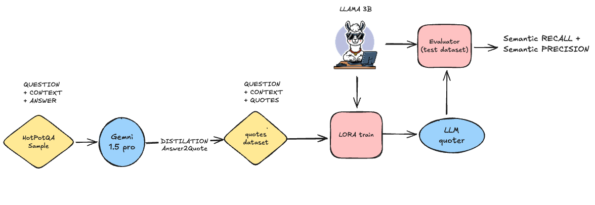
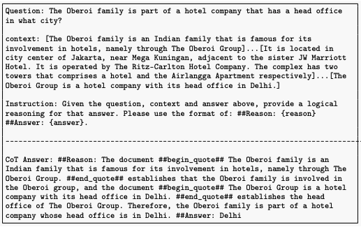
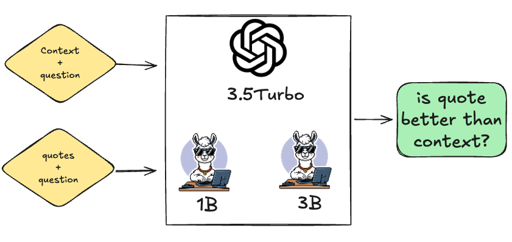

# LLMQuoter: Enhancing RAG Capabilities Through Efficient Quote Extraction From Large Contexts

## Overview

**LLMQuoter** is a lightweight, distillation-based model designed to enhance **Retrieval-Augmented Generation (RAG)** workflows. The model adopts a *"quote-first-then-answer"* strategy, extracting relevant textual evidence (quotes) from large contexts before performing reasoning tasks. 

### RAFT Example

The **Retrieval-Augmented Fine-Tuning (RAFT)** approach involves reasoning and answering directly over the **full context**. RAFT trains models to “think while quoting,” combining reasoning with the ability to extract relevant portions of the text. An example of RAFT inference is shown below:

In RAFT, the model performs the following steps in a single process:
1. Reads the entire context.
2. Extracts quotes inline.
3. Generates a reasoning chain to derive the answer.

While effective, RAFT’s holistic approach can cause cognitive overload, especially for smaller models.

---

**LLMQuoter**, by contrast, separates the quote extraction and reasoning steps:
1. **Step 1**: A smaller model extracts quotes relevant to the question.
2. **Step 2**: The reasoning model focuses solely on the extracted quotes, avoiding the overhead of processing the entire context.

This modular approach simplifies the reasoning task and reduces errors arising from large or noisy contexts. 

The repository includes:
1. **Methodology**: Explanation of the quote extraction process and fine-tuning.
2. **Experiments**: Comparisons between using quotes and full contexts.
3. **Results**: Performance metrics highlighting the benefits of LLMQuoter.

---

## Methodology

### Data Distillation
The process begins by creating a distilled dataset using a high-performing teacher model (e.g., Gemini Pro 1.5). The model extracts **golden quotes** from the context that directly support the answer to a given question. These quotes serve as a foundation for fine-tuning smaller, resource-efficient models.

### Fine-Tuning with LoRA
Using the distilled dataset, a smaller model (LLaMA 3.2:3B) is fine-tuned using **Low-Rank Adaptation (LoRA)**. This technique enables task-specific training while maintaining computational efficiency.

You can find the training step in the following Colab notebook:  
[Fine-Tuning with LoRA on Colab](https://colab.research.google.com/drive/1iDakm6h3hnm20HE1C5wFKtfvdLv3fnvM?usp=sharing)

---

## Experiments

### Dataset
The experiments are conducted on a subset of the **HotpotQA** dataset. The dataset contains:
- **Question**: A specific query.
- **Context**: A large body of text containing the answer.
- **Answer**: The expected response to the question.

**Statistics**:

| Attribute        | Value        |
|------------------|--------------|
| Dataset Name     | HotpotQA     |
| Total Samples    | 15,000       |
| Training Set     | 14,400       |
| Test Set         | 600          |
| Source           | Wikipedia    |
| Topics           | General Knowledge |

### Evaluation Metrics
Using the **DSpy** framework, the performance of quote extraction is evaluated using:
- **Precision**: Fraction of predicted quotes matching the ground truth.
- **Recall**: Fraction of ground truth quotes captured by the predictions.
- **F1-Score**: Harmonic mean of precision and recall.

Semantic accuracy is used to compare the answers generated by models using either **golden quotes** or the **full context**.

---

## Results

### Quoter Performance

The following table shows the improvement in precision, recall, and F1-score after fine-tuning the smaller model with LoRA:

| Metric     | Before Fine-Tuning | After Fine-Tuning | Improvement |
|------------|---------------------|-------------------|-------------|
| Recall     | 48.3%              | 68.0%            | +19.7%      |
| Precision  | 43.6%              | 71.0%            | +27.4%      |
| F1-Score   | 41.3%              | 69.1%            | +27.8%      |

---

### Benefits of Quotes vs. Full Context

The performance of several models was evaluated in two configurations:
1. Using the **full context**.
2. Using **golden quotes**.

| Model          | Full Context Accuracy | Golden Quotes Accuracy | Improvement |
|----------------|------------------------|-------------------------|-------------|
| LLaMA 1B       | 24.4%                 | 62.2%                  | +37.8%      |
| LLaMA 3B       | 57.7%                 | 83.0%                  | +25.3%      |
| GPT-3.5 Turbo  | 75.8%                 | 88.5%                  | +12.7%      |

**Takeaway**: Providing models with extracted quotes significantly boosts their accuracy by reducing cognitive overhead and enabling more focused reasoning.

---

### Example: Quote vs. Context

#### Question:
> Which Walt Disney Pictures film was created first, Finding Dory or The Wild Country?

#### Context:
A lengthy body of text (5,086 characters) covering Disney and Pixar films.

#### Extracted Quotes:
\#\#begin_quote\#\# The Wild Country is a 1970 American adventure film produced by Walt Disney Pictures and directed by Robert Totten. \#\#end_quote\#\# \#\#begin_quote## Finding Nemo is a 2003 American computer-animated family film produced by Pixar Animation Studios and released by Walt Disney Pictures. \#\#end_quote\#\#

#### Model Results:

| Model          | Full Context Answer         | Golden Quotes Answer    |
|----------------|-----------------------------|--------------------------|
| GPT-3.5 Turbo  | Finding Nemo was created first | The Wild Country         |
| LLaMA 1B       | Finding Dory is created first | The Wild Country         |
| LLaMA 3B       | Finding Dory is created first | The Wild Country         |

**Conclusion**: Using quotes aligns model outputs closer to the ground truth answer.

---

## Conclusion and Future Work

This study demonstrates the effectiveness of **quote-first-then-answer** strategies in RAG workflows:
- **Efficiency**: Fine-tuning small models with LoRA achieves significant improvements with minimal computational resources.
- **Performance**: Quote extraction reduces cognitive load, enabling both small and large models to perform better.

### Future Directions:
1. **Dataset Expansion**: Apply the methodology to datasets from different domains.
2. **Reinforcement Learning**: Incorporate techniques like PPO for further refinement.
3. **Scalability**: Train larger models (e.g., 8B parameters) to explore scalability.
4. **Enhanced Prompts**: Develop advanced prompt engineering for improved quote extraction.

